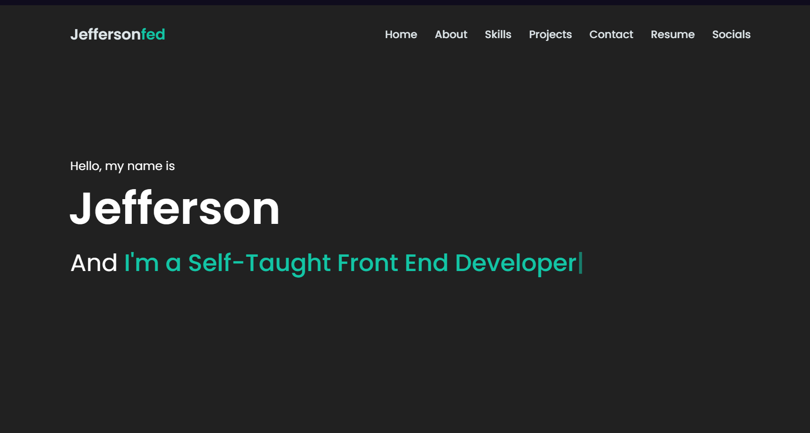
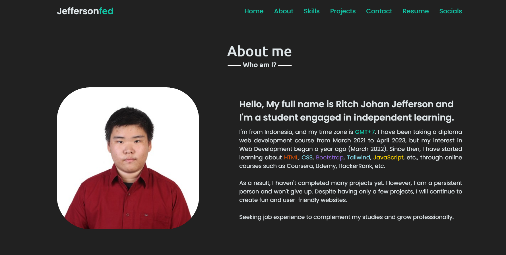
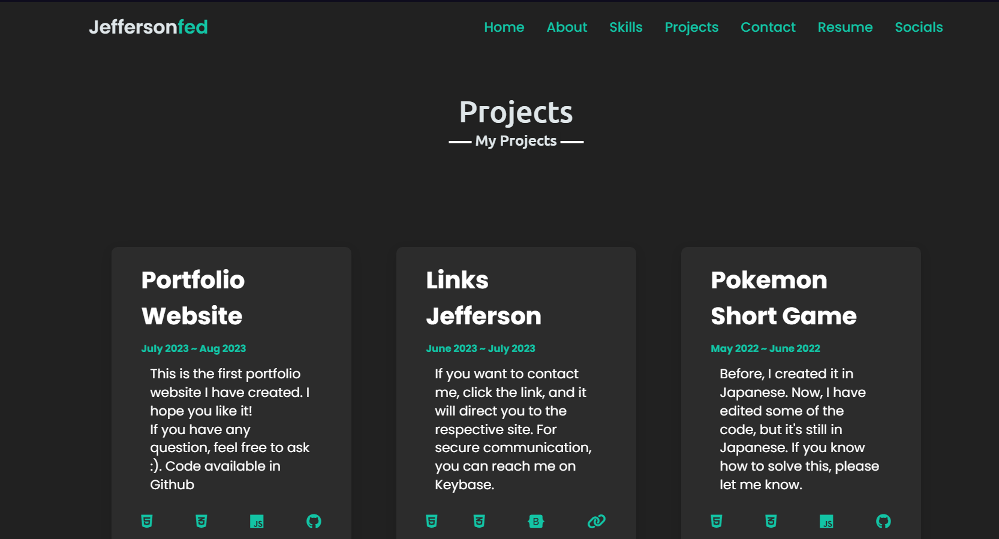
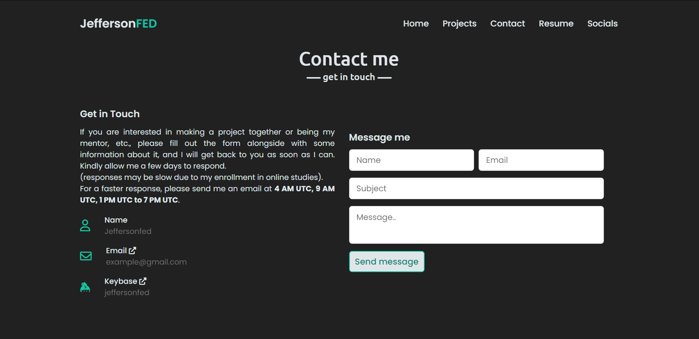
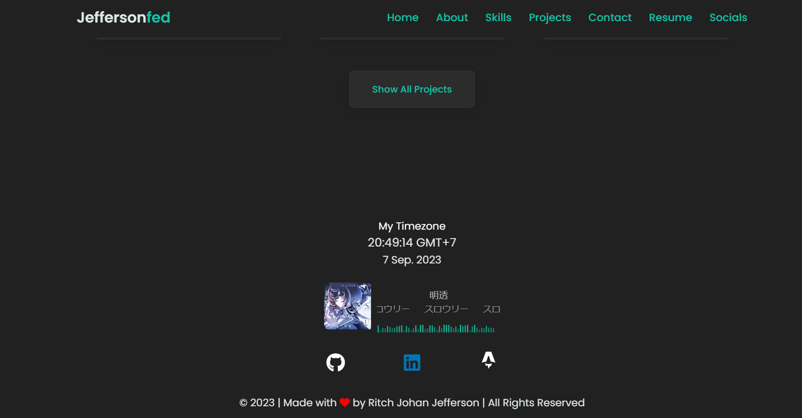
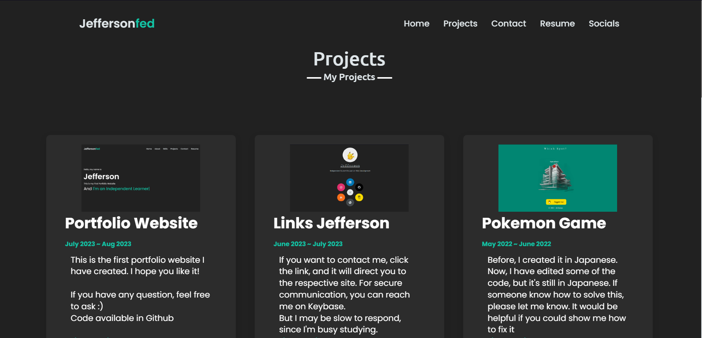

# Old Version Portfolio Site 
<h2 align="center">

<!-- ## 🌐 Socials: -->

 

</h2>

#### Code is not Really clean, But I did what I can

# Tech Stack:
- HTML5
- CSS3
- Javascript
- Font Awesome

[Live Preview](https://jeffersonfed-portfolio-old-ver.netlify.app)
***

# Color Reference
| Color             | Hex                                                                |
| ----------------- | ------------------------------------------------------------------ |
| Light|  #dfe6e9 |
| Dark |  #212121 |
| Green |  #13c4a5 |

# Author
- [Ritch Johan Jefferson](https://github.com/jeffersonfed)

## License

[Creative Commons Zero v1.0 Universal](LICENSE)
